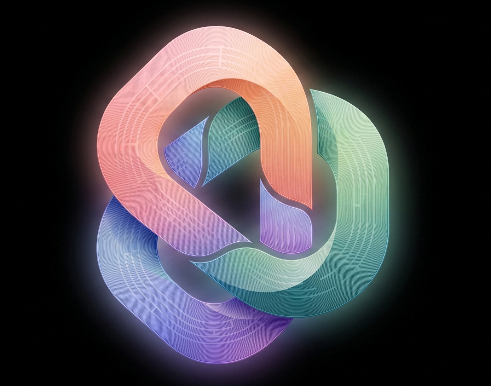

<p align="center">
  <a href="https://www.producthunt.com/products/orquestra?embed=true&utm_source=badge-featured&utm_medium=badge&utm_campaign=badge-orquestra" target="_blank" rel="noopener noreferrer"></a>
</p>

<p align="center">
  
</p>

<h1 align="center">Orquestra</h1>

<p align="center">
  <a href="README.md">English</a> | <a href="README.fr.md">Français</a> | <a href="README.zh-CN.md">简体中文</a> | <a href="README.de.md">Deutsch</a>
</p>

> **Note :** Cette traduction a été générée automatiquement et peut contenir des inexactitudes.

<p align="center">
  Un canevas infini pour votre code, vos terminaux, vos navigateurs, vos documents et vos agents IA.
</p>

<p align="center">
  <a href="https://github.com/leonardo-lacerda/Orquestra/releases"></a>
  <a href="LICENSE"></a>
  <a href="https://github.com/leonardo-lacerda/Orquestra/actions"></a>
  <a href="https://github.com/leonardo-lacerda/Orquestra/releases"></a>
</p>

---

<p align="center">
  
</p>

Orquestra est un IDE de bureau construit sur un canevas infini. Au lieu d'empiler des fenêtres et des onglets, vous répartissez éditeurs, terminaux, navigateurs, documents et agents IA dans un espace libre et les disposez comme vous pensez le projet. Faites flotter les panneaux sur le canevas, ancrez-les en onglets et en divisions, ou détachez-les dans leurs propres fenêtres. Orquestra restaure tout à la réouverture du dossier.

## Démarrage

Ouvrez un dossier. Orquestra en fait un espace de travail et rétablit votre disposition, la position des panneaux et les terminaux à chaque retour. Cliquez droit sur le canevas pour ajouter des panneaux, appuyez sur `Cmd+K` pour la palette de commandes, et glissez des panneaux sur le dock pour créer onglets et divisions. Aucun fichier de configuration à préparer.

## Pourquoi un canevas ?

Alt-tab suffit jusqu'à ce que vous ayez une douzaine de terminaux, six fichiers ouverts, de la documentation dans une autre fenêtre et des notes éparpillées sur plusieurs bureaux. Passé ce point, retrouver la bonne fenêtre devient le goulot d'étranglement.

Orquestra donne à chaque projet un canevas qui se souvient de l'endroit où vous avez laissé les choses. Ce n'est pas un gestionnaire de fenêtres. Les WM en tuiles comme Hyprland, Niri et GlazeWM organisent les fenêtres de tout ce que vous lancez ; Orquestra organise les outils d'un seul projet, plus proche de Figma que d'un WM.

## Ce qu'il contient

**Canevas et disposition.** Zoomez et déplacez un canevas infini, ancrez des panneaux en onglets et divisions sur quatre zones, détachez des panneaux dans des fenêtres séparées et enregistrez des dispositions nommées. Gardez plusieurs projets ouverts et restaurez-les au redémarrage.

**Éditeurs et terminaux.** Panneaux d'éditeur Monaco avec coloration syntaxique, multi-curseur, recherche/remplacement, diffs et aperçu Markdown. Terminaux natifs xterm.js basés sur `node-pty`, ancrés dans l'espace de travail avec détection automatique du shell. Les panneaux de document affichent les PDF, DOCX et images.

**Git.** Une arborescence de fichiers consciente de git avec suivi en direct et recherche, plus une barre latérale de contrôle de source pour l'index, les branches, les worktrees, l'historique et les diffs en ligne. Recherche plein texte dans le projet.

**Agents IA.** Lancez un agent de code intégré (Pi) avec fils de discussion et mémoire de modèle par fil. Connectez Anthropic, OpenAI Codex, GitHub Copilot, Gemini, OpenRouter, Groq, Mistral, DeepSeek et d'autres via OAuth ou clé API. Installez des extensions depuis la marketplace.

**Navigation.** Recherche sur tout le canevas dans les fichiers, le défilement des terminaux et les titres de panneaux (`Cmd+Shift+F`). Sélecteur de panneaux (`Ctrl+Space`). Palette de commandes (`Cmd+K`).

## Installation

Téléchargez une version précompilée. Ne compilez pas depuis les sources pour un usage quotidien.

| Plateforme | Formats | Lien |
|----------|---------|------|
| macOS | DMG, ZIP (`arm64`, `x64`) | [Dernière version](https://github.com/leonardo-lacerda/Orquestra/releases/latest) |
| Windows | Installeur NSIS, ZIP (`x64`) | [Dernière version](https://github.com/leonardo-lacerda/Orquestra/releases/latest) |
| Linux | AppImage, DEB, `tar.gz` (`x64`) | [Dernière version](https://github.com/leonardo-lacerda/Orquestra/releases/latest) |

> **macOS :** les versions publiées sont notariées. Les builds locaux non signés peuvent nécessiter `xattr -cr /Applications/Orquestra.app`.

> **Linux :** sur Steam Deck ou les distributions à racine en lecture seule, utilisez le build `tar.gz`. Si l'AppImage ne démarre pas, essayez `./Orquestra.AppImage --no-sandbox`.

## Compiler depuis les sources

Pour les contributeurs. Sinon, utilisez la version ci-dessus.

**Prérequis :**
- [Node.js](https://nodejs.org/) 20 ou 22 LTS (voir `.nvmrc`). Node 23+ échoue : `node-pty` n'a pas de prebuilds et la compilation native casse.
- npm >= 9
- Python 3 et un compilateur C++ pour `node-pty` :
  - macOS : `xcode-select --install`
  - Debian/Ubuntu : `sudo apt install build-essential python3`
  - Fedora/RHEL : `sudo dnf install @development-tools gcc-c++ make python3`
  - Arch : `sudo pacman -S base-devel python`
  - Windows : [Visual Studio Build Tools](https://visualstudio.microsoft.com/visual-cpp-build-tools/) avec la charge de travail « Développement Desktop en C++ »

```bash
git clone https://github.com/leonardo-lacerda/Orquestra.git
cd orquestra
npm install

npm run dev          # serveur de dev avec rechargement à chaud
npm run typecheck
npm test             # tests unitaires (vitest)
npm run test:e2e     # tests d'intégration Playwright
npm run build        # build de production
npm run package      # packaging pour distribution (:mac, :win, :linux)
```

Les binaires packagés se retrouvent dans `release/`.

## Architecture

```text
src/
├── agent/      # Agent de code Pi intégré : gestionnaire de processus, auth, marketplace, UI du panneau
├── main/       # Processus principal Electron : IPC, espaces de travail, fenêtres, updater, sécurité
├── preload/    # Pont IPC à isolation de contexte
├── renderer/   # App React 18 : canevas, docking, panneaux, barre latérale, stores, hooks
└── shared/     # Canaux IPC et types partagés
```

Orquestra fait passer toute l'IPC par un pont preload à isolation de contexte. L'accès au système de fichiers est limité aux racines d'espace de travail enregistrées, les panneaux navigateur désactivent l'intégration Node, et les terminaux ne peuvent pas s'ouvrir hors des répertoires approuvés.

**Stack :** Electron 41, React 18, Zustand 5, Monaco 0.52, xterm.js 5.5 + node-pty 1.0, Tailwind 3.4, electron-vite, electron-builder, electron-updater, Sentry. PDF et DOCX via pdf.js et mammoth, git via simple-git, surveillance des fichiers via chokidar. Le runtime de l'agent est `@earendil-works/pi`.

## Contribuer

Voir [CONTRIBUTING.md](CONTRIBUTING.md). L'historique version par version se trouve dans le [CHANGELOG](CHANGELOG.md).

## Historique des étoiles

<a href="https://www.star-history.com/#leonardo-lacerda/Orquestra&Date">
  <picture>
    <source media="(prefers-color-scheme: dark)" srcset="https://api.star-history.com/svg?repos=leonardo-lacerda/Orquestra&type=Date&theme=dark" />
    <source media="(prefers-color-scheme: light)" srcset="https://api.star-history.com/svg?repos=leonardo-lacerda/Orquestra&type=Date" />
    
  </picture>
</a>

## Licence

[MIT](LICENSE)
