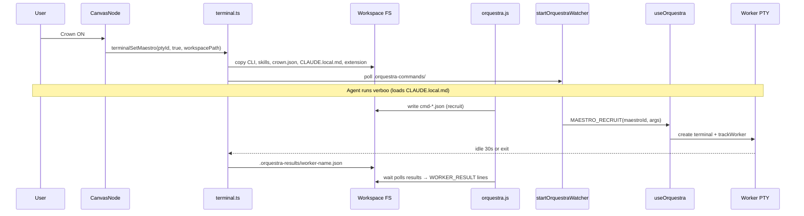
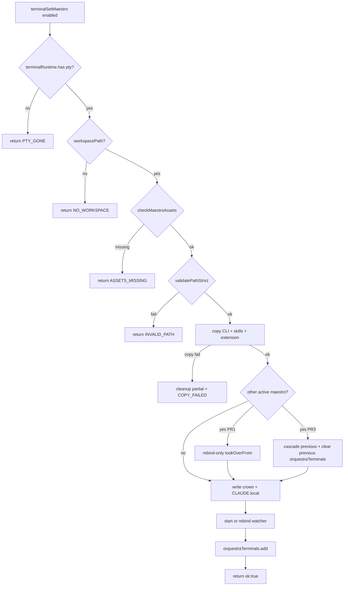
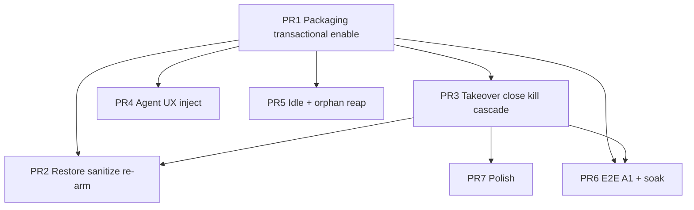

# Maestro Orchestration Launch Readiness

| Field | Value |
|-------|-------|
| **Author** | Orquestra engineering (Leo / launch train) |
| **Date** | 2026-07-10 |
| **Status** | Implemented (2026-07-10 train landed in tree; packaged soak still required) |
| **Repo** | `C:\Users\Leo\Documents\cate` (Orquestra) |
| **Related** | [Orchestration settings plan](./2026-07-09-orchestration-settings.md), [Linked context](./2026-07-10-linked-context-arrows.md) |

---

## Overview

Orquestra’s Maestro orchestration (crown on terminal → CLI recruits workers on the canvas → wait on result files) has shipped beta foundations: hard caps, wait schema, run tracker, linked-context inject, onboarding, and soft permissions copy. Unit and CLI tests are green (~45). **Public launch is not ready** because the packaged product path is broken, session restore does not re-arm main-process Maestro state, multi-crown workspaces mis-route commands, mid-session agent UX is incomplete, and E2E does not exercise the real command-file → recruit path.

This document is the complete technical plan to make Maestro **launch-ready**: fix packaging asset resolution with a fail-closed enable transaction, restore the crown after restart (including multi-flag sessions and PTY respawn), harden single-workspace orchestration (full takeover, close/kill lifecycle, cascade result writes, idle policy), close product gaps with **existing** feedback surfaces (no toast system), and gate release on honest automated + manual criteria.

**Success criteria (verifiable):**

1. Packaged install: enable crown → `orquestra.js` + skills + extension land in workspace; missing assets fail closed (crown never looks ON while broken; no partial main state).
2. Session restore: at most one `panel.maestro === true` per workspace is re-armed when its PTY is live → watcher + CLI + markers live again.
3. Unit + CLI + command-file E2E green; packaging soak checklist executed on Win/mac at least once per RC. (Result-file writers gated by unit tests; optional live-PTY result E2E is not a blocker.)
4. Single active Maestro per workspace via **full takeover** (main + renderer); no silent first-wins; no dual green crowns.
5. Invariant: active `watcher.terminalId` is a live maestro PTY, or the watcher is stopped.
6. After spontaneous shell exit: crown shows **Paused** (not Active); re-arms only when a live PTY exists again.

---

## Background & Motivation

### Current architecture (as implemented)



Key modules today:

| Area | Location |
|------|----------|
| Crown UI + seed from session | `src/renderer/canvas/CanvasNode.tsx` (`maestroEnabled`, `handleToggleMaestro`) |
| Panel flag persistence | `PanelState.maestro` in `src/shared/types.ts`; `setPanelMaestro` in `panelSlice.ts` |
| Enable / copy / watcher | `TERMINAL_SET_MAESTRO` in `src/main/ipc/terminal.ts` |
| Panel close → PTY kill | `panelSlice.closePanel` → `panelTeardown.teardownPanelContent` → `terminalRegistry.dispose` → `TERMINAL_KILL` / `killTerminal` |
| CLI source | `scripts/maestro/orquestra.js` (also root `orquestra.js` dual copy) |
| Pi extension install (agent path) | `src/agent/main/installMaestro.ts` + `findSourceDir` (esbuild → `index.js`) |
| Crown extension copy | raw `index.ts` + `package.json` (package.json `pi.extensions: ["./index.ts"]`) |
| Recruit / dismiss / run tracker | `src/renderer/hooks/useOrquestra.ts`, `orchestrationRunStore.ts` |
| Instructions builder | `src/main/maestro/maestroInstructions.ts` |
| Packaging | `electron-builder.yml` `extraResources` |
| E2E harness smoke | `e2e/orchestration-smoke.spec.ts` + `e2eHarness.enableMaestro` / `recruitWorker` |
| User feedback patterns | terminal inject (`terminalWrite` / `writeToMaestro`), maestro popover copy, OS notify (`notifyOS`), dialogs — **no toast/snackbar component** |

### Pain points (launch blockers)

1. **Packaging asymmetry**: `installMaestroExtension` correctly falls back to `process.resourcesPath/orquestra-extensions/orquestra-maestro`. Crown path uses only `app.getAppPath()/scripts/maestro` and `app.getAppPath()/src/agent/extensions/orquestra-maestro`. electron-builder ships extensions under `resources/orquestra-extensions/` and does **not** ship `scripts/maestro`. Silent `existsSync` skips leave crown green and workspace empty.
2. **Enable half-success**: `setOrquestraTerminal(terminalId, true)` runs **before** path validation and copies; invalid path returns after already adding to `orquestraTerminals`; watcher may start with incomplete files.
3. **Restore half-state**: UI seeds `maestroEnabled` from `panel.maestro` but never re-invokes `terminalSetMaestro` after PTY recreate → no watcher, no CLI copy, stale/missing crown markers. Multi-flag sessions possible from pre-single-maestro era.
4. **First-wins watcher + incomplete disable**: `watcherByWorkspace` stores one `terminalId` per workspace; second crown is skipped. Disable does not call `stopOrquestraWatcher`. Close maestro panel without disable leaves watcher + workers. Cascade kills workers without result files → `wait` hangs.
5. **E2E honesty gap**: smoke seeds recruits and result files via harness; does not write real command files or assert main→renderer dispatch.

---

## Goals & Non-Goals

### Goals

- G1. Packaged Maestro loop works on Windows and macOS (primary launch platforms; Linux is a pack target but **not** a soak gate — see Residual limits).
- G2. Session restore re-arms main-process Maestro for the single chosen panel with `maestro: true`.
- G3. Watcher lifecycle is correct: transactional enable, full takeover, stop on disable, close/kill safety nets, live-PTY invariant.
- G4. Single-active-maestro product rule is explicit and enforced with **complete** main + renderer takeover.
- G5. Idle completion policy reduces false “done” from quiet agents (final defaults locked in KD6).
- G6. Honest gates: command-file → recruit E2E + unit coverage of result writers + packaging soak (not a claim of full loop E2E unless optional tier is green).
- G7. Medium/low polish items addressed or consciously deferred with UI honesty.

### Non-Goals

- Real OS sandbox for network/file (Phase 8 V2).
- Remote/SSH workers as a first-class Maestro path.
- Replacing Verboo / pi-agent with an in-house agent stack.
- Full multi-maestro multiplayer product (parallel crowns with isolated namespaces).
- Hard permission enforcement beyond existing nested-worker / maxWorkers guards.
- Building a general toast/snackbar system.
- Linux packaging soak as a launch blocker (manual if capacity allows).
- New toast framework or ephemeral banner store (use existing surfaces).

### Constraints

- Surgical PRs; reuse `findSourceDir` / `installMaestro` / `installThemeSkill` patterns.
- electron-vite + IPC + zustand + vitest + Playwright harness.
- Permissions remain soft guidance unless already hard (nested workers, max workers).
- Prefer one CLI source of truth: `scripts/maestro/orquestra.js` (root copy is mirror; keep identity test).
- User-visible feedback only via: maestro popover / crown title error string, `terminalWrite`, optional `notifyOS` — not a nonexistent toast API.

---

## Proposed Design

### 1. Packaging path alignment (Blocker)

#### Problem (code)

```133:136:src/main/ipc/terminal.ts
export function getOrquestraCliDir(): string {
  const appPath = app.getAppPath()
  return path.join(appPath, 'scripts', 'maestro')
}
```

```1008:1017:src/main/ipc/terminal.ts
const extSrcDir = path.join(app.getAppPath(), 'src', 'agent', 'extensions', 'orquestra-maestro')
// ...
if (fs.existsSync(extSrcDir)) {
  // copy index.ts + package.json — silent no-op if missing
}
```

Today’s handler also calls `setOrquestraTerminal(terminalId, enabled)` **first** (line ~944), then validates path and copies — so failures leave main state dirty.

Contrast with:

```19:25:src/agent/main/installMaestro.ts
function sourceDir(): string | null {
  return findSourceDir([
    path.join(app.getAppPath(), 'src', 'agent', 'extensions', 'orquestra-maestro'),
    path.join(process.resourcesPath ?? '', 'orquestra-extensions', 'orquestra-maestro'),
  ])
}
```

And `electron-builder.yml` only ships `src/agent/extensions` → `orquestra-extensions` (not `scripts/maestro`).

#### Solution

**A. Ship CLI assets as extraResources**

In `electron-builder.yml`:

```yaml
extraResources:
  - from: src/agent/extensions
    to: orquestra-extensions
    filter: ["**/*"]
  - from: scripts/maestro
    to: orquestra-maestro-cli
    filter:
      - "orquestra.js"
      - "orquestra.cmd"
      - "orquestra-skill.md"
      - "orquestra-worker-skill.md"
  # existing skills + runtime-host...
```

Do **not** ship test files (`*.test.js`, `test-*.js`, `test-*.sh`) into the product.

**B. Shared resolution helper**

Add `src/main/maestro/maestroAssets.ts` (main-process only):

```ts
import path from 'path'
import { app } from 'electron'
import { findSourceDir } from '../../agent/main/extensionInstall'

export function resolveMaestroCliDir(): string | null {
  return findSourceDir([
    path.join(app.getAppPath(), 'scripts', 'maestro'),
    path.join(process.resourcesPath ?? '', 'orquestra-maestro-cli'),
  ])
}

export function resolveMaestroExtensionDir(): string | null {
  return findSourceDir([
    path.join(app.getAppPath(), 'src', 'agent', 'extensions', 'orquestra-maestro'),
    path.join(process.resourcesPath ?? '', 'orquestra-extensions', 'orquestra-maestro'),
  ])
}

export interface MaestroAssetCheck {
  ok: boolean
  cliDir: string | null
  extensionDir: string | null
  missing: string[]
}

export function checkMaestroAssets(): MaestroAssetCheck {
  const cliDir = resolveMaestroCliDir()
  const extensionDir = resolveMaestroExtensionDir()
  const missing: string[] = []
  if (!cliDir) missing.push('cli')
  else {
    for (const f of ['orquestra.js', 'orquestra-worker-skill.md'] as const) {
      if (!fs.existsSync(path.join(cliDir, f))) missing.push(`cli:${f}`)
    }
  }
  if (!extensionDir) missing.push('extension')
  else {
    // Launch: raw TS bundle (see KD12) — require index.ts + package.json
    for (const f of ['index.ts', 'package.json'] as const) {
      if (!fs.existsSync(path.join(extensionDir, f))) missing.push(`extension:${f}`)
    }
  }
  return { ok: missing.length === 0, cliDir, extensionDir, missing }
}
```

Replace `getOrquestraCliDir()` with `resolveMaestroCliDir()`.

**C. Fail-closed enable — transactional order (required)**

Change handler contract:

```ts
// electron-api.d.ts
type TerminalSetMaestroResult =
  | { ok: true; tookOverFrom?: string } // previous maestro pty id if takeover (full cascade only after PR3)
  | {
      ok: false
      error: string
      code?: 'ASSETS_MISSING' | 'INVALID_PATH' | 'COPY_FAILED' | 'NO_WORKSPACE' | 'PTY_GONE'
    }

terminalSetMaestro(
  terminalId: string,
  enabled: boolean,
  workspacePath?: string,
): Promise<TerminalSetMaestroResult>
```

**Enable transaction (strict order — no early `orquestraTerminals.add`):**

```
0. If enabled: require terminalRuntime.has(terminalId). If missing → return { ok:false, code:'PTY_GONE' }.
   Never start a watcher bound to a dead / unknown PTY id.
1. Resolve workspacePath (renderer arg or PTY cwd fallback).
2. If !workspacePath → return { ok:false, code:'NO_WORKSPACE' }. Do not mutate state.
3. checkMaestroAssets() → if !ok → log.error, return { ok:false, code:'ASSETS_MISSING' }.
4. validatePathStrict(workspacePath) → if fail → return { ok:false, code:'INVALID_PATH' }.
5. Copy required files using resolved dirs only:
   - orquestra.js
   - orquestra-worker-skill.md → .claude/commands/worker.md
   - ensure .orquestra-commands/
   - extension: index.ts + package.json → .orquestra/pi-agent/extensions/orquestra-maestro/
   Any missing source or copy throw → compensatory cleanup of partial writes if any, return { ok:false, code:'COPY_FAILED' }.
6. If another watcher/maestro is active for this workspace with different terminalId:
   **PR1 minimum (rebind-only):** rebind watcher.terminalId + ownerWindowId to the new id;
   return tookOverFrom without cascade / without removing previous from orquestraTerminals.
   **PR3 completes (full KD4):** cascade previous workers (failed results + notify) +
   orquestraTerminals.delete(previous) — see §3.1. Do not stop the poller; rebind after step 8.
7. Write crown.json + CLAUDE.local.md (+ reapply linked-context, existing).
8. startOrquestraWatcher / rebind watcher.terminalId + ownerWindowId to this terminalId.
9. **Only now** setOrquestraTerminal(terminalId, true)  // orquestraTerminals.add
10. return { ok:true, tookOverFrom?: previousPtyId }
```

**PR ownership of step 6 (locked):** PR1 ships the transactional skeleton (steps 0–5, 7–10) with **rebind-only** step 6 so packaging/fail-closed lands alone without cascade ownership. PR3 upgrades step 6 to full cascade + previous `orquestraTerminals` remove. Engineers must not implement full cascade in PR1 or ship permanent first-wins without documenting the interim.

**Disable order:**

```
1. setOrquestraTerminal(terminalId, false)  // cascade workers with result writes (§3.4)
2. If watcher.terminalId === terminalId → stopOrquestraWatcher(workspacePath)
3. Delete crown.json; delete CLAUDE.local.md (existing — residual risk documented)
4. return { ok:true }
```



**Renderer `handleToggleMaestro` (no optimistic permanent success):**

```ts
// On enable:
// 1. Optionally set local spinner / leave crown off until ok
// 2. const result = await terminalSetMaestro(ptyId, true, rootPath)
// 3. if (!result.ok) {
//      setMaestroEnabled(false)
//      setPanelMaestro(wsId, panelId, false)
//      setCrownError(result.error)  // shown in maestro gear popover + GrabButton title
//      terminalWrite(ptyId, `[orquestra] Maestro enable failed: ${result.error}\r`)
//      return
//    }
// 4. setMaestroEnabled(true); setPanelMaestro(..., true); clear crown error
// 5. if (result.tookOverFrom) clear other panels' maestro flags (also done in ensureSingleMaestro)
// 6. terminalWrite notice for mid-session Verboo (§4)
//
// On disable: await disableMaestroForPanel(...); set local off
```

If user clicks enable **before** `ptyId` exists: set `panel.maestro = true` + local flag, and let the **ensure armed** effect (§2) call main when pty appears (same path as restore). Do not claim success until IPC returns ok.

Dev-mode missing assets also fail closed.

**D. Extension copy strategy (locked — KD12)**

**Launch decision: keep raw TypeScript copy** for the crown path:

- Copy `index.ts` + `package.json` (entry remains `./index.ts` as in `src/agent/extensions/orquestra-maestro/package.json`).
- Do **not** esbuild in PR1; do **not** change package.json entry to `index.js`.
- Rationale: matches current crown behavior and package.json; terminal `verboo` discovers the workspace extension as TS the same way it does in dev. The Agent-panel path (`installMaestroExtension`) continues to esbuild to `index.js` into the **host agent dir** independently — that is a different install target (runtime agent home), not the crown workspace copy.
- PR1 must not leave “research whether pi loads TS” open: **requirement is raw TS**, documented here. If a future bug shows workspace pi cannot load TS in packaged builds, that is a follow-up PR to share the esbuild helper and update `package.json` to `./index.js` — out of launch PR1 unless dogfood fails.

**E. Tests**

- Unit: `maestroAssets.test.ts` with mocked `app.getAppPath` / `resourcesPath` / temp dirs.
- Unit: enable transaction never adds to `orquestraTerminals` when copy fails; invalid path after assets still clean.
- Keep `orquestraWait.cli.test.ts` identity check: root `orquestra.js` ≡ `scripts/maestro/orquestra.js`.

---

### 2. Session restore re-arm (High)

#### Problem

```595:621:src/renderer/canvas/CanvasNode.tsx
const [maestroEnabled, setMaestroEnabled] = React.useState(() => {
  return currentWorkspace.panels[node.panelId]?.maestro === true
})
// handleToggleMaestro calls terminalSetMaestro only on user click
// no effect when maestroEnabled && maestroPtyId becomes available after restore
```

PTYs are recreated on mount via `terminalRegistry` / `TerminalPanel`; panel flag persists in session JSON; main-process `orquestraTerminals` + watchers do not.

#### Solution: unified `ensureMaestroArmed` + dead-PTY / paused path

**Code reality (registry):** On `TERMINAL_EXIT`, the renderer registry entry **lingers** with the same `ptyId` and `alive: false` (`registryState.ts` / `terminalLifecycle.ts`). It does **not** auto-respawn. `ptyEpoch` only bumps for worktree-driven respawn. So after spontaneous shell exit, `maestroPtyId` is often still the **dead** id.

Extract `src/renderer/lib/maestro/ensureMaestroArmed.ts` used by:

1. Restore / mount effect when `panel.maestro && live ptyId`
2. User enable when pty was null at click time (wait until live)
3. `ptyEpoch` / **new live** pty id while `panel.maestro` still true
4. **Never** short-circuit on a dead registry entry

```ts
/** Last successfully armed pty id per panelId (module Map). */
const armedPtyByPanel = new Map<string, string>()

function isLivePty(panelId: string, ptyId: string): boolean {
  const entry = terminalRegistry.getEntry(panelId)
  return !!entry && entry.ptyId === ptyId && entry.alive === true
}

export async function ensureMaestroArmed(opts: {
  workspaceId: string
  panelId: string
  ptyId: string
  rootPath: string
}): Promise<TerminalSetMaestroResult> {
  // Short-circuit only if we already armed THIS id AND the registry still says alive.
  // Dead id with armed map entry must NOT return ok (would leave silent-green crown).
  if (
    armedPtyByPanel.get(opts.panelId) === opts.ptyId
    && isLivePty(opts.panelId, opts.ptyId)
  ) {
    return { ok: true }
  }
  if (!isLivePty(opts.panelId, opts.ptyId)) {
    // Do not call main with a dead id — main would reject PTY_GONE after PR1 step 0,
    // but renderer should enter paused UI without a useless IPC.
    clearMaestroArmed(opts.panelId)
    return { ok: false, error: 'Terminal not running', code: 'PTY_GONE' }
  }
  const result = await window.electronAPI.terminalSetMaestro(
    opts.ptyId, true, opts.rootPath,
  )
  if (result.ok) {
    armedPtyByPanel.set(opts.panelId, opts.ptyId)
    useAppStore.getState().setPanelMaestro(opts.workspaceId, opts.panelId, true)
    if (result.tookOverFrom) clearOtherMaestroFlags(opts.workspaceId, opts.panelId)
  } else {
    armedPtyByPanel.delete(opts.panelId)
    // PTY_GONE / ASSETS_MISSING: do not leave a green "Active" crown
    if (result.code === 'ASSETS_MISSING' || result.code === 'COPY_FAILED') {
      useAppStore.getState().setPanelMaestro(opts.workspaceId, opts.panelId, false)
    }
    // PTY_GONE while flag true → stay in paused (flag may remain; UI not Active)
  }
  return result
}

export function clearMaestroArmed(panelId: string): void {
  armedPtyByPanel.delete(panelId)
}

/** Call from TERMINAL_EXIT handler when this panel's maestro flag is set. */
export function onMaestroRegistryExit(panelId: string): void {
  clearMaestroArmed(panelId)
  // Keep panel.maestro === true (user intent) but UI must show paused — not Active.
  // Main already ran onMaestroPtyGone (watcher stopped, markers deleted).
}
```

**Crown UI states (required — not silent green):**

| State | `panel.maestro` | Registry | Main watcher | Crown UI |
|-------|-----------------|----------|--------------|----------|
| Off | false | any | none | Inactive (default purple) |
| Active | true | alive pty armed | running for this pty | green / “Active” |
| **Paused** | true | `alive: false` or no pty | stopped (after `onMaestroPtyGone`) | crown color muted / badge **“Paused”**; title/popover: “Terminal exited — Maestro paused. Restart the terminal (or Retry) to re-arm.” |
| Re-arming | true | new live pty, IPC in flight | transitioning | “Re-arming…” then Active or error |

User may click crown while Paused to fully disable (`setPanelMaestro false`) or wait for a **new live** PTY (Retry / `ptyEpoch` / remount) which re-runs `ensureMaestroArmed`.

**Renderer reaction on maestro `TERMINAL_EXIT` (wire explicitly):**

```ts
// Where registry sets entry.alive = false (terminalLifecycle / TERMINAL_EXIT path):
if (panel.maestro) {
  onMaestroRegistryExit(panelId)
  setCrownPausedUi(panelId) // local or derive: maestro && !alive
}
// Do NOT call ensureMaestroArmed with the dead id (it returns PTY_GONE and must not look Active).
// Do NOT clear panel.maestro automatically (product: intent survives shell exit until user disables
// or enable fails hard on assets). Main markers/watcher already cleared by onMaestroPtyGone.
```

**Re-arm path when a new live PTY appears:**

```mermaid
sequenceDiagram
  participant Shell as Maestro shell
  participant Reg as terminalRegistry
  participant Main as onMaestroPtyGone
  participant UI as Crown UI
  participant Ensure as ensureMaestroArmed

  Shell->>Reg: TERMINAL_EXIT → alive=false same ptyId
  Shell->>Main: onExit → stop watcher + delete markers + cascade workers
  Reg->>UI: onMaestroRegistryExit → clearMaestroArmed; crown Paused
  Note over UI: panel.maestro still true; not Active
  Note over UI: User Retry / ptyEpoch / new session
  UI->>Reg: new live ptyId
  UI->>Ensure: ensureMaestroArmed(newPty) because alive
  Ensure->>Main: terminalSetMaestro true (PTY_GONE check passes)
  Main-->>Ensure: ok
  Ensure->>UI: Active
```

**Multi-flag session sanitize (required before re-arm):**

On workspace hydrate / first canvas mount for a workspace, run once:

```ts
export function sanitizeMaestroFlags(workspaceId: string): string | null {
  // Find all panels with maestro === true
  // If 0 → return null
  // If 1 → return that panelId
  // If >1 → keep preferred, clear others via setPanelMaestro(..., false)
  // Preference order (launch — no crown.json FS read from renderer):
  //   1) focused terminal panel if it has maestro
  //   2) else first by stable panelId sort (localeCompare)
  // return kept panelId
  // (Optional future: crown.json activatedAt via FS IPC — not launch scope)
}
```

Only the kept panel’s crown UI stays ON/Paused; only it re-arms. Prevents mount-order races (PR2 after PR3).

**Hook / effect in CanvasNode (or `useMaestroRestore`):**

```ts
const entryAlive = /* subscribe registry alive for panelId */
const maestroPaused = panel?.maestro === true && (!maestroPtyId || !entryAlive)

useEffect(() => {
  if (!panel?.maestro || !maestroPtyId || !rootPath) return
  if (!entryAlive) return // paused — do not arm dead id
  void ensureMaestroArmed({ workspaceId, panelId, ptyId: maestroPtyId, rootPath })
    .then((result) => {
      if (!result.ok && result.code !== 'PTY_GONE') {
        // hard fail: assets etc. — clear flag
        setPanelMaestro(workspaceId, panelId, false)
        setCrownError(result.error)
      } else if (result.ok) {
        setCrownError(null)
      }
    })
}, [panel?.maestro, maestroPtyId, entryAlive, rootPath, workspaceId, panelId])
// New live ptyId (or alive flip true after recreate) triggers re-arm
```

On successful user disable: `clearMaestroArmed(panelId)` + `setPanelMaestro(..., false)`.

**User enable on dead PTY:** toggle must check `alive` first; if false → set crown error “Terminal not running — restart the shell, then enable Maestro” and **do not** call IPC (or accept `PTY_GONE` from main). Do not set Active.

**Verification:** unit tests for (1) short-circuit only when armed+alive, (2) exit → clearMaestroArmed + paused UI, (3) new live pty re-arms, (4) sanitize multi-flag without crown.json, (5) enable rejects dead pty; manual quit/reopen + shell-exit-then-retry.

---

### 3. Watcher lifecycle & single active Maestro (High)

#### Problems

1. `startOrquestraWatcher`: first terminal wins; subsequent enables log and return.
2. Disable path removes crown markers + CLAUDE.local.md but **never** calls `stopOrquestraWatcher(workspacePath)`.
3. Closing the maestro panel does not call disable → watcher + orphan workers remain.
4. `closeWorkersForOrchestrator` kills without result files / status notify → `wait` hangs; renderer maps stay active.
5. Shell exit on maestro PTY leaves watcher bound to dead id.
6. `crown.json` single file; CLI `send()` lacks `maestroId`.

#### Launch product rule: **one active Maestro per workspace — full takeover** (KD4 locked)

| Behavior | Spec |
|----------|------|
| Second crown ON | **Full takeover** (not reject): cascade previous workers with result writes, clear previous panel flag + UI, rebind watcher, rewrite crown |
| Disable | Cascade workers (results), stop watcher if this was active, delete markers |
| Panel close / kill / maestro PTY exit | Same as disable for that maestro (safety nets on both sides) |

Reject-with-message is **rejected** for launch: takeover matches last-crown-wins mental model and avoids a half-implemented dual-mode.

#### 3.1 Full takeover sequence (main + renderer)

```mermaid
sequenceDiagram
  participant UI as CanvasNode B
  participant Main as terminalSetMaestro
  participant Track as workerTracking
  participant FS as results + crown
  participant Watch as watcherByWorkspace
  participant Store as appStore + runStore
  participant NodeA as CanvasNode A

  UI->>Main: enable(ptyB, ws)
  Main->>Main: assets + path + copy OK
  Main->>Track: for each worker of ptyA: write failed result + notifyWorkerStatus
  Main->>Track: kill worker PTYs; delete tracking
  Main->>Main: orquestraTerminals delete ptyA; add deferred until end
  Main->>FS: write crown.json terminalPtyId=ptyB
  Main->>Watch: rebind terminalId=ptyB
  Main->>Main: orquestraTerminals.add(ptyB)
  Main-->>UI: { ok:true, tookOverFrom: ptyA }
  UI->>Store: setPanelMaestro(B,true); setPanelMaestro(A,false)
  UI->>Store: clearMaestro(ptyA); clearMaestroArmed(A)
  Note over NodeA: panel.maestro false → local maestroEnabled effect off
  UI->>UI: terminalWrite(ptyB, takeover notice)
```

**Main — extract `cascadeOrchestratorWorkers(orchestratorId, reason: 'disabled' | 'takeover')`:**

Replace today’s `closeWorkersForOrchestrator` body:

```ts
function cascadeOrchestratorWorkers(
  orchestratorId: string,
  reason: 'disabled' | 'takeover' | 'maestro-exit',
): void {
  for (const [workerId, tracking] of [...workerTracking.entries()]) {
    if (tracking.orchestratorId !== orchestratorId) continue
    const summary =
      reason === 'takeover'
        ? 'Orchestrator taken over by another Maestro terminal.'
        : reason === 'maestro-exit'
          ? 'Maestro terminal exited.'
          : 'Orchestrator disabled.'
    // Write result BEFORE delete tracking so wait unblocks
    if (tracking.workspacePath) {
      writeWorkerResultFile(tracking.workspacePath, {
        workerName: tracking.name,
        workerRole: tracking.role,
        status: 'failed',
        summary,
        timestamp: Date.now(),
        exitCode: 1,
      })
    }
    notifyWorkerStatus({
      workerId,
      orchestratorId,
      name: tracking.name,
      status: 'failed',
      exitCode: 1,
    })
    if (tracking.idleTimer) clearTimeout(tracking.idleTimer)
    const runtime = getRuntimeForTerminal(workerId)
    try { runtime?.process.kill?.(workerId) } catch { /* already dead */ }
    workerTracking.delete(workerId)
    log.info('[orquestra] cascade %s: worker %s (%s)', reason, workerId, tracking.name)
  }
}
```

**CLI semantics:** cascade ⇒ `status: failed` so `orquestra wait` exits non-zero for those names (honest: work was aborted). Document in release notes.

**Main — takeover inside enable (after successful copy):**

```ts
const existing = watcherByWorkspace.get(workspacePath)
const previousPty =
  existing && existing.terminalId !== terminalId ? existing.terminalId : null
if (previousPty) {
  cascadeOrchestratorWorkers(previousPty, 'takeover')
  orquestraTerminals.delete(previousPty)
  // do not stop watcher — rebind below
}
// write crown, rebind or start watcher, then orquestraTerminals.add(terminalId)
return { ok: true, tookOverFrom: previousPty ?? undefined }
```

**Renderer — after `{ ok:true, tookOverFrom }`:**

1. `setPanelMaestro(wsId, newPanelId, true)`
2. For every other panel in workspace with `maestro`: `setPanelMaestro(wsId, otherId, false)` + `clearMaestroArmed(otherId)`
3. `useOrchestrationRunStore.getState().clearMaestro(tookOverFrom)`
4. `releaseWorkerTracking` / clear maps in `useOrquestra` for previous maestro (also driven by `onOrquestraWorkerStatus` failed events from cascade — must not double-count; status events free slots)
5. Inject on **new** maestro PTY:  
   `[orquestra] Maestro active here. Previous Maestro (if any) was disabled and its workers stopped.`

**Forcing previous crown UI off without events:** previous `CanvasNode` seeds/holds local `maestroEnabled` from `panel.maestro`. Prefer **deriving** display state from store:

```ts
const maestroEnabled = currentWorkspace.panels[node.panelId]?.maestro === true
// or sync effect: setMaestroEnabled(panel.maestro === true) when panel.maestro changes
```

If local state is kept, add:

```ts
useEffect(() => {
  setMaestroEnabled(currentWorkspace.panels[node.panelId]?.maestro === true)
}, [currentWorkspace.panels[node.panelId]?.maestro])
```

so takeover clearing the flag turns the previous crown purple-off.

#### 3.2 Panel close / teardown / kill lifecycle

**Canonical close graph (real code):**

```
closePanelWithConfirm / runAction / CanvasNode.handleClose / dock close / canvas child cascade
  → appStore.closePanel(wsId, panelId)           // synchronous
    → teardownPanelContent(panelId, type, 'close')
      → terminalRegistry.dispose(panelId)
        → electronAPI.terminalKill(ptyId)        // async IPC fire-and-forget
    → remove panel record from workspace
```

Also: `removePanelFromWindow` (transfer uses `release`, not kill), selection multi-close, worktree delete, e2e harness.

**Required hook (single place — do not scatter only in CanvasNode):**

In `closePanel` **before** `teardownPanelContent`, or at the start of `teardownPanelContent` when `reason === 'close'` and panel is terminal with `maestro`:

```ts
// panelSlice.closePanel — before teardown:
if (panel?.type === 'terminal' && panel.maestro) {
  void disableMaestroForPanel(workspaceId, panelId)
}
// Also when closing a canvas: for each child panel with maestro, disable first
```

`disableMaestroForPanel` (no empty-string IPC):

```ts
export async function disableMaestroForPanel(
  workspaceId: string,
  panelId: string,
): Promise<void> {
  const ws = useAppStore.getState().workspaces.find(w => w.id === workspaceId)
  const ptyId = terminalRegistry.ptyIdForPanel(panelId) // may be null if already torn down
  clearMaestroArmed(panelId)
  useAppStore.getState().setPanelMaestro(workspaceId, panelId, false)
  if (ptyId) {
    useOrchestrationRunStore.getState().clearMaestro(ptyId)
    await window.electronAPI.terminalSetMaestro(ptyId, false, ws?.rootPath || '')
    return
  }
  // No ptyId: local-only cleanup. Do NOT call terminalSetMaestro('', …).
  // Main cleanup is already guaranteed by onMaestroPtyGone on kill/exit when
  // the PTY dies, or by a prior disable that still had a ptyId.
  // Optional non-launch IPC: terminalStopMaestroWorkspace(rootPath) — not required.
}
```

**Async vs sync close:** `closePanel` stays synchronous. Prefer calling `disableMaestroForPanel` **before** dispose so `ptyId` is still available for IPC. If dispose races and `ptyId` is already gone, local-only cleanup is correct — main `onMaestroPtyGone` is the backstop for watcher/markers/workers.

**Files to touch (PR3):**

| File | Role |
|------|------|
| `src/renderer/lib/maestro/disableMaestroForPanel.ts` | shared disable |
| `src/renderer/lib/maestro/ensureMaestroArmed.ts` | arm + takeover flag clear |
| `src/renderer/stores/appStore/panelSlice.ts` | closePanel pre-teardown disable |
| `src/renderer/lib/panels/panelTeardown.ts` | optional belt if type+flag available (prefer panelSlice so workspaceId is known) |
| `src/renderer/canvas/CanvasNode.tsx` | toggle + derive maestro from store |
| `src/main/ipc/terminal.ts` | cascade results, takeover, stop watcher, kill/exit safety net |
| `scripts/maestro/orquestra.js` (+ root) | maestroId in payload |

**Not sufficient alone:** only patching `CanvasNode.handleClose` — misses dock, palette, canvas-parent cascade, worktree delete, etc.

#### 3.3 Maestro PTY exit / kill invariant

**Invariant:** `watcherByWorkspace.get(ws).terminalId` is always a PTY still registered in `terminalRuntime`, **or** the watcher entry is removed.

**Main safety net** in `killTerminal` and `onExit` (after `onWorkerExit` for workers):

```ts
function onMaestroPtyGone(terminalId: string): void {
  if (!orquestraTerminals.has(terminalId)) {
    // still check watcher in case of desync
  }
  orquestraTerminals.delete(terminalId)
  cascadeOrchestratorWorkers(terminalId, 'maestro-exit')
  for (const [wsPath, entry] of watcherByWorkspace) {
    if (entry.terminalId === terminalId) {
      stopOrquestraWatcher(wsPath)
      // delete crown.json + CLAUDE.local.md for wsPath (same as disable markers)
      tryDeleteCrownMarkers(wsPath)
      log.info('[orquestra] maestro pty gone — watcher stopped for %s', wsPath)
    }
  }
}

// killTerminal(id):
//   onMaestroPtyGone(id)  // before or after process.kill — cascade workers first while runtime may still kill them
//   existing cleanup...

// onExit(id):
//   onWorkerExit(id, exitCode)  // no-op if not a tracked worker
//   onMaestroPtyGone(id)
//   cleanupTerminal...
```

**Renderer (connect to §2 paused path):** After main `onMaestroPtyGone`, registry still holds the **same** dead `ptyId` with `alive: false`. Renderer must:

1. On `TERMINAL_EXIT` for a maestro panel → `onMaestroRegistryExit(panelId)` (`clearMaestroArmed`).
2. Show **Paused** crown UI (not Active) while `panel.maestro && !alive`.
3. **Not** call `ensureMaestroArmed` until a **new live** pty appears (or the same id flips alive after respawn — today shell exit does not flip alive without recreate).
4. When live again → `ensureMaestroArmed` → main enable (step 0 `terminalRuntime.has` passes) → Active.

Spontaneous shell exit is therefore: main stops watcher + deletes markers; renderer pauses UI; user Retry/respawn re-arms. Closing the panel still runs `disableMaestroForPanel` (clears flag).

**Tests:** unit for onMaestroPtyGone stops watcher; exit clears armed map + paused UI; ensure re-arm only when alive; enable rejects dead id (`PTY_GONE`).

#### 3.4 Command payload

```js
// scripts/maestro/orquestra.js send()
function readMaestroId() {
  try {
    const crown = JSON.parse(fs.readFileSync(path.resolve('.orquestra/crown.json'), 'utf8'))
    return crown.terminalPtyId || null
  } catch { return null }
}
// payload: { cmd, args, maestroId: readMaestroId(), timestamp: Date.now() }
```

Watcher:

```ts
const maestroId = payload.maestroId || entry.terminalId
if (payload.maestroId && payload.maestroId !== entry.terminalId) {
  log.warn('[orquestra] drop cmd %s: maestroId mismatch', filename)
  fs.unlinkSync(filePath)
  continue
}
sendToWindow(ownerWindowId, CHANNEL, maestroId, args)
```

---

### 4. Agent already running / mid-session CLAUDE.local.md (High)

#### Problem

Verboo loads project instructions at session start. Enabling crown mid-session writes `CLAUDE.local.md` but the running agent does not re-read it.

#### Solution (no toast system)

On successful enable:

1. **Primary:** `terminalWrite` to the maestro PTY (always on successful enable):

   ```
   [orquestra] Maestro enabled. If Verboo is already running, restart it (or open a new terminal) so it loads CLAUDE.local.md orchestration rules.
   ```

2. **Secondary:** static copy in the maestro **gear popover** (i18n), always visible while enabled — not a toast.

3. **Do not** use a toast/banner component. Optional: `notifyOS` only if product already uses OS notifications for similar tips — default **off** for launch to avoid noise.

4. Do **not** re-send full system prompt into an interactive TUI.

Files: `ensureMaestroArmed` / toggle success path, `CanvasNode` popover, `translations.ts`, `buildMaestroEnableNotice()` in `maestroInstructions.ts`.

---

### 5. Real E2E (High) — honest gates

#### Current gap

`e2e/orchestration-smoke.spec.ts` uses harness `recruitWorker` + hand-written result files + CLI wait. It never writes `.orquestra-commands/cmd-*.json` for main poll dispatch.

#### Split gates (do not claim “full loop” E2E unless tier A3 is green)

| Gate | What | Required for launch? |
|------|------|----------------------|
| **A1** | Command-file → recruit: write `cmd-*.json`, assert worker node / run tracker within poll window | **Yes** |
| **A2** | Unit tests for `writeWorkerResultFile` / `onWorkerExit` / `onWorkerIdle` / cascade writes | **Yes** (already partly present; extend for cascade) |
| **A3** | Optional E2E: recruit via command file, `orquestraTrackWorker` real path, kill worker PTY or wait idle, assert **disk** result without seeding | **No** (nice-to-have); if skipped, Overview language must not say “full loop E2E” |
| **B** | `scripts/maestro/verify-packaged-assets.mjs` + human soak doc | **Yes** for public RC |
| **C** | Live Verboo LLM orchestration | Manual only |

**Tier A1 steps:**

1. Enable maestro via harness (copies CLI).
2. Write recruit command file (same shape as CLI including `maestroId`).
3. `expect.poll` worker appears / `orchestrationWorkers` length ≥ 1 (timeout 10s).
4. Existing CLI wait may still use seeded results for wait CLI regression **or** only assert recruit in the new spec.

Keep harness recruit tests as fast unit of canvas/run-tracker if useful; **add** command-file path rather than only replacing.

**Soak checklist path (single):**  
`docs/superpowers/checklists/2026-07-10-maestro-packaging-soak.md`  
Asset verifier: `scripts/maestro/verify-packaged-assets.mjs`.

---

### 6. Idle 30s false-complete (Medium)

#### Problem

```263:263:src/main/ipc/terminal.ts
const WORKER_IDLE_TIMEOUT = 30000 // 30 seconds
```

`feedWorkerOutput` resets a 30s timer and always calls `onWorkerIdle` — quiet thinking without enough stdout → premature wait success.

#### Final defaults (KD6 locked — no open 60 vs 90)

| Constant | Value |
|----------|-------|
| `WORKER_IDLE_TIMEOUT_MS` | **60_000** |
| `WORKER_IDLE_FAST_MS` | **10_000** (after explicit done marker) |
| `WORKER_MIN_LINES_BEFORE_IDLE` | **3** non-empty lines in `outputBuffer` |
| `WORKER_MIN_RUNTIME_MS` | **10_000** after first output line (eligible even if &lt; 3 lines once this elapsed **and** at least 1 line) |
| Done marker regex | `/\b(ORQUESTRA_WORKER_DONE|TASK COMPLETE)\b/i` |

**Residual hang:** if the agent never prints (≥1 line) and never exits, idle will never complete — user must dismiss worker or kill PTY. Documented; preferred over false DONE.

#### Replace `feedWorkerOutput` timer block

```ts
const DONE_MARKER_RE = /\b(ORQUESTRA_WORKER_DONE|TASK COMPLETE)\b/i

function hasExplicitDoneMarker(lines: string[]): boolean {
  return lines.some((l) => DONE_MARKER_RE.test(l))
}

function idleEligible(tracking: WorkerTracking): boolean {
  if (hasExplicitDoneMarker(tracking.outputBuffer)) return true
  const lines = tracking.outputBuffer.length
  if (lines >= WORKER_MIN_LINES_BEFORE_IDLE) return true
  if (lines >= 1 && Date.now() - tracking.firstOutputAt >= WORKER_MIN_RUNTIME_MS) return true
  return false
}

export function feedWorkerOutput(workerId: string, data: string): void {
  const tracking = workerTracking.get(workerId)
  if (!tracking) return
  tracking.lastActivity = Date.now()
  // ... strip ansi, push lines ...
  if (tracking.outputBuffer.length > 0 && !tracking.firstOutputAt) {
    tracking.firstOutputAt = Date.now()
  }
  if (tracking.idleTimer) clearTimeout(tracking.idleTimer)
  const arm = () => {
    if (!workerTracking.has(workerId)) return
    const t = workerTracking.get(workerId)!
    if (!idleEligible(t)) {
      // Not eligible yet: re-check later without completing
      t.idleTimer = setTimeout(arm, WORKER_IDLE_TIMEOUT_MS)
      return
    }
    const quietMs = hasExplicitDoneMarker(t.outputBuffer)
      ? WORKER_IDLE_FAST_MS
      : WORKER_IDLE_TIMEOUT_MS
    t.idleTimer = setTimeout(() => onWorkerIdle(workerId), quietMs)
  }
  arm()
}
```

Add `firstOutputAt?: number` on the tracking record.

**Worker policy text:** update `workerRoleWithPolicy` in `src/renderer/hooks/useOrquestra.ts` (exact function name) to require ending summary with `ORQUESTRA_WORKER_DONE` on its own line.

**Tests** (`terminal.test.ts`): no idle complete with 0–2 lines before min runtime; marker → fast path; ≥3 lines + silence → done; exit still authoritative.

---

### 7. Windows tracking orphan reap (Medium)

#### Problem

`scanActivity` returns `{}` on win32; heartbeat early-returns. Does not detect hung-but-registered PTYs.

#### Solution (reworded)

This is **not** a “dead-worker process heartbeat.” It is **tracking-orphan reap** after runtime map cleanup:

```ts
// Inside the existing 60s interval in terminal.ts (module-private terminalRuntime):
const activity = await runtime.process.scanActivity(ids).catch(() => null)
if (activity && Object.keys(activity).length > 0) {
  // existing POSIX missing-from-ps → onWorkerExit
} else {
  // win32 or empty scan: reap tracking entries whose PTY is no longer in terminalRuntime
  for (const [workerId] of tracked) {
    if (!terminalRuntime.has(workerId)) {
      log.warn('[orquestra] orphan reap: worker %s not in terminalRuntime', workerId)
      onWorkerExit(workerId, 1) // writes result + notify
    }
  }
}
```

**Does detect:** killTerminal/cleanup removed runtime without going through `onWorkerExit`.  
**Does not detect:** hung agent still registered. Idle policy + user dismiss cover that. Cascade disable (§3.1) must not depend on this reap.

---

### 8. Maestro panel close cleanup (Medium)

Fully specified in §3.2–3.3. Summary:

- Renderer: `disableMaestroForPanel` from `closePanel` before dispose.
- Main: `onMaestroPtyGone` on kill/exit.
- Cascade writes failed results + `notifyWorkerStatus` so renderer `onOrquestraWorkerStatus` frees maxWorkers / run tracker.
- Also `clearMaestro` on disable success path.

---

### 9. Result file name collisions (Medium)

Single active maestro ⇒ collisions only on same worker name re-recruit. `allocateUniqueWorkerName` + overwrite `running` on track remain. Cascade/dismiss write terminal status. Nested result dirs deferred.

---

### 10. Renderer run-tracker loss on reload (Medium)

Document-only for launch (KD10). Popover empty-state copy: worker list resets after reload; disk results remain under `.orquestra-results/`.

---

### 11. `orchestrationOnWorkerDone: 'hide'` (Low)

**Option A (locked):** remove `hide` from `OrchestrationSettings` Select; keep type in `AppSettings` for forward compat; if stored value is `hide`, treat as `keep-open` at runtime.

---

### 12. Approximate worker count (Low)

Use `useOrchestrationRunStore` active/list counts for the maestro pty; fall back to `orquestraListWorkers` when popover open. Never count all workspace terminals.

---

### 13. Dual `orquestra.js` drift (Low)

Identity test stays. Packaging ships only `scripts/maestro` copy.

---

### 14. Skill `orquestra-skill.md` wait workflow (Low)

Add wait step to skill content. Crown does not currently copy this file to the workspace (only worker skill + js); still fix content for manual/docs; optional follow-up: copy to `.claude/commands/maestro.md` — not required for launch if `CLAUDE.local.md` is primary.

---

### 15. Manual packaging soak checklist (Low)

**Single path:** `docs/superpowers/checklists/2026-07-10-maestro-packaging-soak.md`

Minimum steps (Win + mac RC; Linux optional):

1. Build package (`npm run package:win` / `:mac`).
2. Install to clean machine / clean userData.
3. Open project → new terminal → crown ON.
4. Assert `orquestra.js`, `.orquestra/crown.json`, `CLAUDE.local.md`, extension files under `.orquestra/pi-agent/extensions/orquestra-maestro`.
5. `node orquestra.js recruit --role "noop" --name t1` → worker appears.
6. Kill worker → result file `failed` or idle/exit → `node orquestra.js wait --workers t1 --timeout 60`.
7. Quit app → reopen → crown re-arms → recruit works.
8. Close maestro panel → watcher stopped (stale recruit does not spawn).
9. Second terminal crown ON → first crown off, previous workers failed results.

---

## Residual / known limits (launch honesty)

| Topic | Limit |
|-------|-------|
| `CLAUDE.local.md` delete on disable | Existing: disable **deletes** the whole file. User content not managed by Maestro is lost. Enable overwrites then re-applies linked-context. Residual risk for users who hand-edit `CLAUDE.local.md`. Mitigate later with managed markers; not launch-blocking if release notes warn. |
| Workspace-root `orquestra.js` | Copied into project root → can show as **git dirty** / untracked. Release note: add to `.gitignore` or commit as team convention. Not auto-gitignored by Orquestra (avoid surprising ignore rules). |
| Linux soak | AppImage/deb/tar are pack targets; **soak gate is Win + mac only**. Linux best-effort. |
| Full loop E2E | A1 + A2 required; A3 optional (see §5). |
| Hung registered worker on Windows | No process-tree scan; idle + user dismiss. |
| Multi-maestro multiplayer | Explicit non-goal. |
| Toast UI | Not built; use popover + terminal inject. |

---

## API / Interface Changes

### IPC `terminalSetMaestro`

**Before:** `Promise<void>`; `setOrquestraTerminal` first.

**After:** `Promise<TerminalSetMaestroResult>` with transactional enable (§1C). Optional field `tookOverFrom?: string`.

Update: `src/shared/electron-api.d.ts`, `src/preload/index.ts`, `src/main/ipc/terminal.ts`, harness `enableMaestro`.

### Command file schema

```ts
interface OrquestraCommandFile {
  cmd: 'recruit' | 'dismiss' | 'connect' | 'list' | 'reassign'
  args: Record<string, unknown>
  timestamp: number
  maestroId?: string
}
```

### Events / renderer

No new toast channel. Cascade already emits `ORQUESTRA_WORKER_STATUS` (`failed`) per worker — renderer must treat as terminal for tracking maps.

### Internal helpers (new)

- `src/main/maestro/maestroAssets.ts`
- `src/renderer/lib/maestro/disableMaestroForPanel.ts`
- `src/renderer/lib/maestro/ensureMaestroArmed.ts`
- `src/renderer/lib/maestro/sanitizeMaestroFlags.ts`
- Main: `cascadeOrchestratorWorkers`, `onMaestroPtyGone`, `tryDeleteCrownMarkers`

---

## Data Model Changes

| Artifact | Change |
|----------|--------|
| `PanelState.maestro` | Unchanged; at most one true per workspace after sanitize/takeover |
| `.orquestra/crown.json` | Single file; active maestro only |
| `.orquestra-commands/*.json` | Optional `maestroId` |
| Worker tracking | + `firstOutputAt?: number` |
| Session / run tracker | No persistence for launch |
| `electron-builder.yml` | CLI extraResources |

Migration: none. Sanitize multi-flag on load.

---

## Alternatives Considered

### Packaging

| Alt | Pros | Cons |
|-----|------|------|
| **A. extraResources + findSourceDir (chosen)** | Matches installMaestro/theme skill; asar-safe | Builder yml change |
| B. Bundle CLI into asar under dist | No extraResources | Path fragility with asar |
| C. Download CLI on first crown | Smaller package | Network dependency |

### Multi-maestro / second crown

| Alt | Pros | Cons |
|-----|------|------|
| **A. Full takeover (chosen, KD4)** | Complete product rule; no dual crowns | Cascades previous workers |
| B. Reject with message | Smaller cascade | Worse UX; still need dual-flag handling |
| C. Soft document only | Zero code | Silent bugs remain |

### Extension copy

| Alt | Pros | Cons |
|-----|------|------|
| **A. Raw TS + package.json (chosen, KD12)** | Matches crown today; no esbuild in hot path | Differs from installMaestro JS output |
| B. esbuild + index.js entry | Matches agent install | Extra PR1 complexity; must rewrite package.json |

### Session restore

| Alt | Pros | Cons |
|-----|------|------|
| **A. Auto re-arm + multi-flag sanitize (chosen)** | Matches user expectation | Must handle asset failures |
| B. Clear all flags until user re-enables | Simple | Feels broken |

### Idle policy

| Alt | Pros | Cons |
|-----|------|------|
| **A. Min lines + 60s + markers (chosen)** | Fewer false DONE | Slow quiet agents wait longer; 0-output hangs until exit |
| B. Exit-only | No false complete | Wait hangs without process exit |
| C. User-configurable idle | Flexible | Settings surface |

---

## Security & Privacy Considerations

| Topic | Notes |
|-------|-------|
| Path validation | `validatePathStrict` before any write |
| Command allowlist | Unchanged switch on `cmd` |
| CLAUDE.local.md | Overwrite on enable; **delete on disable** (residual — see Residual limits) |
| Soft permissions | Unchanged |
| Packaging | No test scripts in extraResources |
| Result summaries | Same as scrollback risk |

---

## Observability

| Event | Level | Where |
|-------|-------|-------|
| Assets missing on enable | `error` | `terminalSetMaestro` |
| Copy / enable transaction success | `info` | `terminal.ts` |
| Takeover cascade | `info` | `cascadeOrchestratorWorkers` |
| Watcher start / rebind / stop | `info` | watcher helpers |
| Maestro pty gone | `info` | `onMaestroPtyGone` |
| Command drop (maestroId mismatch) | `warn` | poller |
| Tracking orphan reap | `warn` | 60s interval |
| Enable failure | user-visible | crown title + popover + `terminalWrite` |
| Takeover / mid-session tip | user-visible | `terminalWrite` + popover copy |

---

## Rollout Plan

### Feature flags

None required. Avoid `ORQUESTRA_MAESTRO_STRICT_ASSETS=0` escape hatch.

### Stages

1. Land PR1 → PR3 → PR2 (required order) then PR5, PR4, PR6, PR7.
2. Dogfood packaging soak Win + mac.
3. RC go/no-go.
4. Release notes: single Maestro/workspace, restart Verboo after crown, `orquestra.js` git dirty, `CLAUDE.local.md` delete on disable.

### Rollback

Per-PR revert. Enable transaction is forward-safe.

### Go / No-Go criteria

| # | Criterion | Gate |
|---|-----------|------|
| 1 | Packaged app: crown enable copies CLI + crown.json | Blocker |
| 2 | Missing assets → fail closed; no `orquestraTerminals` add | Blocker |
| 3 | Session restore re-arms single maestro | Blocker |
| 4 | Panel close + kill/exit stop watcher | Blocker |
| 5 | Full takeover (flags + workers + results) | Blocker |
| 6 | Cascade writes failed results (unit) | Blocker |
| 7 | `npm test` green | Blocker |
| 8 | E2E A1 command-file → recruit | High |
| 9 | Unit A2 result writers + cascade | Blocker |
| 10 | Idle policy tests (KD6 defaults) | Medium |
| 11 | Packaging soak Win+mac signed off | Blocker for public |
| 12 | `hide` not advertised | Low |
| 13 | Optional A3 full disk result E2E | Non-blocking |

---

## Risk Register

| ID | Risk | Severity | Mitigation |
|----|------|----------|------------|
| R1 | Packaged path wrong on one OS | **Critical** | findSourceDir; verify script; soak |
| R2 | Re-arm races / shell exit leaves dead ptyId in registry | High | short-circuit only if armed+alive; Paused UI; PTY_GONE; re-arm on new live pty |
| R3 | Takeover aborts previous workers | Medium | Product rule; failed results; terminal notice |
| R4 | Longer idle delays wait | Medium | Markers + exit path |
| R5 | Hung registered PTY on Windows | Medium | Idle + user dismiss; orphan reap only |
| R6 | E2E flaky poll | Medium | 10s expect.poll |
| R7 | CLAUDE.local.md delete/overwrite | Medium | Residual limits + release notes |
| R8 | Dual orquestra.js drift | Low | Identity test |
| R9 | git dirty orquestra.js | Low | Release notes / .gitignore convention |
| R10 | closePanel fire-and-forget disable races kill | Medium | Main onMaestroPtyGone safety net |
| R11 | Multi-flag session dual re-arm | Medium | sanitizeMaestroFlags before re-arm |
| R12 | Linux unsoaked | Low | Explicit non-gate |

---

## Open Questions

Resolved in this revision:

1. ~~Takeover vs reject~~ → **Takeover (KD4)**.
2. ~~Result type~~ → **Typed `TerminalSetMaestroResult` required**.
3. ~~Run tracker persist~~ → **No for launch (KD10)**.
4. ~~orquestra-skill.md scope~~ → Fix content; workspace copy optional.
5. ~~Idle 60 vs 90~~ → **60s (KD6)**.

Remaining (non-blocking):

1. Whether to auto-append `orquestra.js` to a project-local `.gitignore` recommendation in onboarding (product preference).
2. Whether OS notify for enable failure is ever desired (default off).

---

## References

- `src/main/ipc/terminal.ts` — Maestro IPC, watcher, idle, results, kill/exit
- `src/renderer/stores/appStore/panelSlice.ts` — `closePanel`
- `src/renderer/lib/panels/panelTeardown.ts` — dispose vs release
- `src/agent/main/installMaestro.ts` / `extensionInstall.ts` — asset resolution + esbuild path
- `electron-builder.yml` — extraResources
- `scripts/maestro/orquestra.js` — CLI
- `src/renderer/canvas/CanvasNode.tsx` — crown UI
- `src/renderer/hooks/useOrquestra.ts` — recruit + `workerRoleWithPolicy`
- `src/renderer/stores/orchestrationRunStore.ts` — UI tracker
- `src/main/maestro/maestroInstructions.ts` — CLAUDE.local.md builder
- `e2e/orchestration-smoke.spec.ts` — current smoke
- `docs/superpowers/plans/2026-07-09-orchestration-settings.md` — settings phases

---

## Key Decisions

| ID | Decision | Rationale |
|----|----------|-----------|
| KD1 | Ship Maestro CLI via `extraResources` (`orquestra-maestro-cli`) and resolve with `findSourceDir` | Same pattern as pi extensions and theme skill; asar-safe |
| KD2 | `terminalSetMaestro` returns structured success/failure; **transactional enable** (PTY live check → assets → path → copy → step 6 → crown → watcher → then `orquestraTerminals.add`). Dead PTY → `PTY_GONE` | Silent skip and early add are packaged-app failure modes; never bind watcher to dead id |
| KD3 | Session restore via unified `ensureMaestroArmed` (short-circuit only if armed **and** registry `alive`); multi-flag **sanitize** keeps one panel (focused, else stable id — no crown.json); shell exit → **Paused** UI + `clearMaestroArmed`, re-arm only on new live pty | Matches flag without silent-green after shell exit; registry keeps dead ptyId |
| KD4 | **One active Maestro per workspace with full takeover** (cascade previous workers with failed results, clear previous `panel.maestro` + UI, rebind watcher). Not reject-with-message. **PR1 ships rebind-only step 6; PR3 upgrades to full cascade** | Multi-maestro non-goal; split ownership keeps PR1 mergeable |
| KD5 | Command files carry optional `maestroId` from `crown.json`; mismatch dropped | Cheap correctness |
| KD6 | Idle: **60s** quiet after eligibility; **min 3 lines** OR (1+ line and **10s** since first output); marker → **10s**; exit authoritative; 0-output never idle-completes | Locked defaults; cuts false DONE |
| KD7 | Windows interval does **tracking-orphan reap** via module-private `terminalRuntime.has`, not process-tree dead detection | scanActivity empty on win32; hung PTYs are residual |
| KD8 | E2E gates: **A1** command-file→recruit required; **A2** unit result writers required; **A3** live disk result optional — do not claim full-loop E2E without A3 | Honest CI |
| KD9 | Remove unfinished `hide` from settings UI | Product honesty |
| KD10 | Run tracker non-persisted for launch | Avoid zombie running badges |
| KD11 | **Required merge order:** PR1 → PR3 → PR2, then PR5 / PR4 / PR6 / PR7 | Restore must land on full takeover + fail-closed assets |
| KD12 | Crown extension copy stays **raw `index.ts` + package.json`**; do not esbuild in PR1 | Matches package.json `pi.extensions`; agent installMaestro JS path is separate |
| KD13 | User feedback: **popover + terminalWrite** (+ optional notifyOS); no toast system | No toast component in renderer |
| KD14 | Cascade/disable writes **failed** result files + `notifyWorkerStatus` before kill | Unblocks `wait`; frees renderer slots |
| KD15 | Main `onMaestroPtyGone` on kill/exit; renderer disable before dispose when ptyId known; **no empty-string IPC** when ptyId missing (local-only) | Live watcher invariant; kill/exit is main backstop |
| KD16 | After spontaneous maestro shell exit: keep `panel.maestro`, show **Paused** (not Active), clear armed map; re-arm only when `alive` again | Registry lingers with dead ptyId; short-circuit-on-id-only would silent-green |

---

## PR Plan

Each PR is mergeable with tests. **Required train:** PR1 → PR3 → PR2.

### PR1 — Packaging asset resolution + fail-closed transactional enable

**Depends on:** nothing  

**Files:**

- `electron-builder.yml` — extraResources `scripts/maestro` → `orquestra-maestro-cli`
- `src/main/maestro/maestroAssets.ts` + `maestroAssets.test.ts`
- `src/main/ipc/terminal.ts` — resolvers; **reorder enable** (steps 0–5, 7–10); `PTY_GONE` if `!terminalRuntime.has`; return `TerminalSetMaestroResult`; no early `orquestraTerminals.add`
- Step 6 in PR1: **rebind-only** if watcher exists for another id (return `tookOverFrom` without cascade / without deleting previous from `orquestraTerminals`)
- `src/shared/electron-api.d.ts`, `src/preload/index.ts`
- `src/renderer/canvas/CanvasNode.tsx` — await result; crown error string + `terminalWrite` on failure (no toast)
- `src/renderer/lib/e2eHarness.ts` — enableMaestro handles result
- `src/main/maestro/orquestraWait.cli.test.ts` — identity test
- Extension: raw TS copy only (KD12)

**Description:** Ship CLI; resolve like installMaestro; fail-closed transactional enable. **Does not** implement full cascade takeover (that is PR3). Interim dual-maestro main state after rebind-only is accepted only until PR3 lands on the same train.

**Verify:**

```bash
npm test -- src/main/maestro/maestroAssets.test.ts src/main/ipc/terminal.test.ts
```

---

### PR2 — Session restore re-arm + multi-flag sanitize + paused crown

**Depends on:** **PR1 + PR3** (required — needs full takeover + `onMaestroPtyGone` + lifecycle)  

**Files:**

- `src/renderer/lib/maestro/ensureMaestroArmed.ts` — short-circuit only if armed **and** `alive`; dead-id path
- `src/renderer/lib/maestro/sanitizeMaestroFlags.ts` — focused then stable id sort (no crown.json)
- `src/renderer/lib/terminal/terminalLifecycle.ts` (or EXIT subscriber) — `onMaestroRegistryExit` when maestro panel exits
- `src/renderer/canvas/CanvasNode.tsx` / `useMaestroRestore.ts` — Active / Paused / Re-arming UI
- Workspace hydrate call site (session restore path)
- Tests: multi-flag sanitize; exit→paused; re-arm only on live pty; no short-circuit on dead id

**Description:** One maestro flag per workspace; ensure armed only for live PTYs; paused UI after shell exit; re-arm on new live pty.

**Verify:** unit + manual quit/reopen + shell exit then Retry.

---

### PR3 — Watcher lifecycle, full takeover cascade, close/kill, cascade results

**Depends on:** PR1  

**Files:**

- `src/main/ipc/terminal.ts` — **upgrade enable step 6** to `cascadeOrchestratorWorkers` + `orquestraTerminals.delete(previous)`; stop on disable; `onMaestroPtyGone` in `killTerminal`/`onExit`; command `maestroId` routing
- `scripts/maestro/orquestra.js` (+ root mirror)
- `src/renderer/lib/maestro/disableMaestroForPanel.ts` — local-only when no ptyId (no empty-string IPC)
- `src/renderer/stores/appStore/panelSlice.ts` — disable before teardown on close (+ canvas children)
- `src/renderer/canvas/CanvasNode.tsx` — store-synced crown; takeover notice via terminalWrite
- `src/renderer/hooks/useOrquestra.ts` — status failed frees maps; clearMaestro on disable
- Tests: cascade writes failed results; full takeover rebind; kill maestro stops watcher; CLI maestroId

**Description:** Completes KD4 full single-maestro product rule (cascade + flag clear path) on top of PR1’s rebind-only step 6.

**Verify:** vitest cascade/takeover/kill; CLI payload tests.

---

### PR4 — Mid-session agent UX (terminal inject + popover)

**Depends on:** PR1  

**Files:**

- `ensureMaestroArmed` / toggle success path — always `terminalWrite` notice
- `CanvasNode` maestro popover copy
- `src/renderer/i18n/translations.ts`
- `maestroInstructions.ts` — `buildMaestroEnableNotice()`

**Description:** Restart-Verboo guidance without toast.

**Verify:** manual; i18n keys present.

---

### PR5 — Idle policy + tracking-orphan reap

**Depends on:** PR1 recommended for shared test harness only; **no hard code dep** — may parallelize after PR1 lands to reduce conflict on `terminal.ts`. If parallel with PR3, rebase carefully (same file).  

**Files:**

- `src/main/ipc/terminal.ts` — `feedWorkerOutput` eligibility (KD6), orphan reap
- `src/renderer/hooks/useOrquestra.ts` — `workerRoleWithPolicy` done marker line
- `src/main/ipc/terminal.test.ts`

**Description:** False-done mitigation; Windows orphan reap wording.

**Verify:** vitest idle eligibility + orphan reap.

---

### PR6 — Command-file E2E + packaging checklist

**Depends on:** PR1, PR3  

**Files:**

- `e2e/orchestration-command-file.spec.ts` (or extend smoke) — gate A1
- `scripts/maestro/verify-packaged-assets.mjs`
- `docs/superpowers/checklists/2026-07-10-maestro-packaging-soak.md` — **only** soak path

**Description:** Honest A1 E2E; asset verify; human soak. Does not claim A3 unless implemented.

**Verify:** `npm run test:e2e -- e2e/orchestration-command-file.spec.ts`

---

### PR7 — Polish batch

**Depends on:** PR3 (worker count / run store)  

**Files:**

- `CanvasNode.tsx` — run-store worker counts
- `OrchestrationSettings.tsx` + translations — remove `hide`
- `scripts/maestro/orquestra-skill.md` — wait workflow
- Residual copy in popover empty state (run tracker)

**Verify:** unit + settings options list.

---

### PR dependency graph



### Required merge order for launch train

1. **PR1** → 2. **PR3** → 3. **PR2** → 4. PR5 → 5. PR4 → 6. PR6 → 7. PR7  

PR2 **must not** merge before PR3 (takeover + disable lifecycle incomplete).

---

## Implementation Notes for Engineers

1. Reuse `findSourceDir` from `src/agent/main/extensionInstall.ts`.
2. **Extension:** raw `index.ts` copy only (KD12). Do not start esbuild research in PR1.
3. Disable order: cascade workers (results) → stop watcher if active → delete markers.
4. `closePanel` is sync: `void disableMaestroForPanel(...)` before dispose; main `onMaestroPtyGone` is the backstop.
5. Derive crown UI from `panel.maestro` store field so takeover clears previous crowns without a toast/event bus.
6. No toast component — popover error string + `terminalWrite`.
7. Do not broaden to remote workers or hard sandboxes.
8. Follow karpathy-guidelines: surgical diffs; Verify steps per PR are success criteria.

---

## Appendix A — Current vs target packaging resolution

| Asset | Dev path | Packaged path (target) | Consumer |
|-------|----------|------------------------|----------|
| CLI `orquestra.js` | `app.getAppPath()/scripts/maestro` | `resources/orquestra-maestro-cli` | `terminalSetMaestro` |
| Worker skill | same | same | `terminalSetMaestro` |
| Extension (raw TS) | `.../src/agent/extensions/orquestra-maestro` | `resources/orquestra-extensions/orquestra-maestro` | crown copy |
| Extension (esbuild JS) | same source | same | `installMaestroExtension` → agent home (unchanged) |
| Theme skill (prior art) | `skills/orquestra-theme` | `resources/skills/...` | `installThemeSkill` |

## Appendix B — Problem index → PR mapping

| # | Problem | PR |
|---|---------|-----|
| 1 | Packaging path | PR1 |
| 1b | Fail-closed transactional enable order | PR1 |
| 2 | Session restore | PR2 |
| 2b | Multi-flag session sanitize | PR2 |
| 3 | Single watcher multi-maestro / full takeover | PR3 |
| 3b | Cascade result files + renderer release | PR3 |
| 3c | Panel close / kill / maestro exit lifecycle | PR3 |
| 4 | Agent mid-session | PR4 |
| 5 | Real E2E (A1 + checklist; A2 units) | PR6 + PR3/5 tests |
| 6 | Idle 30s false-complete | PR5 |
| 7 | Windows tracking orphan reap | PR5 |
| 8 | Panel close cleanup | PR3 |
| 9 | Result name collisions | PR7 / single-maestro |
| 10 | Run tracker reload | PR7 (document) |
| 11 | hide unfinished | PR7 |
| 12 | Approximate worker count | PR7 |
| 13 | Dual orquestra.js | PR1 identity test |
| 14 | Skill wait workflow | PR7 |
| 15 | Packaging soak checklist | PR6 |
| 16 | CLAUDE.local delete residual | Residual limits + notes |
| 17 | git dirty orquestra.js | Residual limits + notes |
| 18 | Linux soak non-gate | Residual limits |
