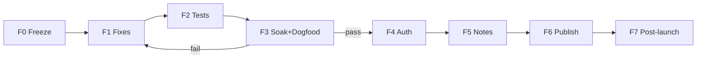

# Plano de desenvolvimento — Launch Orquestra (Maestro-ready)

| Field | Value |
|-------|-------|
| **Date** | 2026-07-12 |
| **Status** | In progress — F0–F2 + A2b + auth unit done; F3 soak / F6 publish deferred to human (package:win + R2 later) |
| **Goal** | Lançar instalador Windows (e opcionalmente macOS) com Maestro confiável no path empacotado |
| **Repo** | `C:\Users\Leo\Documents\cate` (Orquestra) |
| **Related** | [Launch readiness 2026-07-10](./2026-07-10-orchestration-launch-readiness.md), [Maestro 100% 1–4](./2026-07-11-maestro-100-percent-points-1-4.md), [Pool+queue](./2026-07-11-maestro-pool-queue.md), [Multi-Maestro](./2026-07-11-multi-maestro-control-plane.md), [Soak checklist](../checklists/2026-07-10-maestro-packaging-soak.md), [Publicar R2](../../COMO-PUBLICAR-NOVA-VERSAO.md) |

---

## 1. Objetivo e definição de pronto

### 1.1 O que “lançar” significa neste plano

| Entrega | Obrigatório para v1? |
|---------|----------------------|
| Instalador Windows (NSIS/ZIP) no feed R2 | **Sim** |
| Auto-update aponta para `latest.yml` no R2 | **Sim** |
| Maestro no **packaged** Win: crown → pool ≤4 → wait 0 → re-arm | **Sim** |
| Multi-Maestro: 2 crowns sem cruzar inject/workers | **Sim** (feature já shipada; precisa dogfood) |
| Auth + subscription ativa (login Supabase) | **Sim** se o app empacotado exige `authorized` |
| Code signing Windows (CSC) | **Desejável** (não bloqueia soft launch; SmartScreen piora) |
| Soak macOS | Só se mac for plataforma de launch |
| Linux soak | Não |
| Intelligent Maestro (DAG / anti-self-implement FS) | Não (v1.1+) |
| Permissions V2 (sandbox OS) | Não |

### 1.2 Success bar (gate de release)

Só marcar release quando **todos** passarem:

1. **CLI identity:** `orquestra.js` (raiz) === `scripts/maestro/orquestra.js` (teste Vitest verde).
2. **Unit/CLI:** suite de orquestração + wait CLI verde.
3. **E2E A1:** `e2e/orchestration-command-file.spec.ts` verde (local ou CI).
4. **Soak packaged Win:** checklist [maestro-packaging-soak](../checklists/2026-07-10-maestro-packaging-soak.md) 100% marcado + resultados no fim do ficheiro.
5. **Dogfood pool (5/5):** prompt detalhado, `maxWorkers=4` → **≤4** panels worker; fila drena; wait 0.
6. **Dogfood multi (1 run):** crowns A+B; recruit mesmo nome; inject só no dono; dismiss A não mata B.
7. **Restore:** quit/reopen → crown re-arma com PTY vivo; shell morto → **Paused** (não Active mentiroso).
8. **Auth:** conta com sub `active`/`trialing` entra; sem sub vê motivo honesto.
9. **Release notes:** CHANGELOG cobre o delta desde a última tag pública; limites residuais documentados.
10. **Publish:** artefatos no R2; app “Verificar atualizações” vê a versão.

### 1.3 Já landado (não reimplementar)

| Área | Onde |
|------|------|
| Assets packaged + fail-closed | `maestroAssets.ts`, `electron-builder.yml` |
| Re-arm / Paused / sanitize multi-flag | `ensureMaestroArmed.ts`, `rearmDecision.ts`, `CanvasNode.tsx` |
| Pool + queue + `claimHead` | `poolQueuePolicy.ts`, `runQueueCoordinator.ts`, `useOrquestra.ts` |
| Multi-Maestro control plane | `multiMaestroPolicy.ts`, runs sob `.orquestra/runs/{runId}/` |
| Idle estrito + permission guard + inject curto | `terminal.ts` (`isWorkerIdleEligible`, `formatMaestroWorkerInject`) |
| CLAUDE.local gerido | `claudeLocalManaged.ts` |
| Auth desktop | `electronAuth.ts`, `AuthGate.tsx` |
| Publish path | `docs/COMO-PUBLICAR-NOVA-VERSAO.md`, feed R2 |

---

## 2. Mapa de fases

```
Fase 0  RC freeze + higiene do repo          (½ dia)
Fase 1  Bugs de release (CLI sync + fixes)   (½–1 dia)
Fase 2  Verificação automatizada             (½ dia)
Fase 3  Packaged soak + dogfood              (1–2 dias)  ← gate de produto
Fase 4  Auth / billing smoke                (½ dia)
Fase 5  Release notes + version bump         (½ dia)
Fase 6  Publish R2 (+ signing se houver)     (½ dia)
Fase 7  Pós-launch (só se F0–F6 verdes)      (backlog)
```

**Regra:** não começar Fase 6 sem Fases 0–5 verdes.  
**Regra:** bugs encontrados no soak voltam para Fase 1 com severidade; soak recomeça no cenário falhado.



---

## 3. Fase 0 — RC freeze e higiene

### Objetivo

Árvore previsível para empacotar; zero “meio dev” no instalador.

### Trabalho

| # | Task | Done when |
|---|------|-----------|
| 0.1 | Listar untracked/modified (`git status`) | Lista classificada: entra no RC / fica de fora / lixo |
| 0.2 | Remover do tree o que não é produto (`package-win-build.log`, `mcps/` se acidental, etc.) | Não aparecem no pack |
| 0.3 | Drawing tools / terminal lifecycle em curso: **ou** fechar e commitar **ou** stash/branch lateral | `main` (ou branch `release/x.y.z`) só com o que vai shipar |
| 0.4 | Branch de release: `release/1.x.y` a partir de commit estável | Branch criada; CI local mínimo definido |
| 0.5 | Confirmar `package.json` version alvo | Número alinhado com o que se vai publicar |

### Critério de saída

Working tree limpa **no branch de release** (ou só diffs intencionais de release notes/version).

---

## 4. Fase 1 — Bugs e gaps de código (pré-soak)

### 1.1 CLI identity (bloqueante de CI)

**Problema:** `scripts/maestro/orquestra.js` ≠ `orquestra.js` (raiz).  
Canónico usa install `orquestra.cjs` + comentários novos; raiz ficou atrás.  
Teste: `src/main/maestro/orquestraWait.cli.test.ts` falha.

**Work**

1. Copiar conteúdo canónico → raiz **ou** script de sync documentado; preferência do repo: **identidade byte-a-byte**.
2. Confirmar que `installOrquestraCliToWorkspace` continua a copiar do path canónico (`scripts/maestro` / resources).
3. Rodar teste de identity.

**Files**

- `scripts/maestro/orquestra.js` (source of truth)
- `orquestra.js` (mirror)
- `src/main/maestro/orquestraWait.cli.test.ts`

**Verify**

```powershell
node node_modules/vitest/vitest.mjs run src/main/maestro/orquestraWait.cli.test.ts
```

### 1.2 Auditoria rápida pós-identity (só se soak prévio falhou ou logs suspeitos)

Não abrir refactors grandes. Checklist de regressão de código (15–30 min):

| Check | Path |
|-------|------|
| Fail-closed enable | `terminal.ts` `TERMINAL_SET_MAESTRO` |
| Re-arm só com PTY alive | `ensureMaestroArmed` + `CanvasNode` |
| Pool enqueue + `claimHead` | `useOrquestra` + `runQueueCoordinator` |
| Resolve worker **só** no namesMap do run | `resolveOwnedWorkerPanel` |
| Soft-read `latest.json` | `fsReadFileIfExists` em `useOrquestra` |

**Só implementar fix se houver falha reprodutível** (issue no soak → bug ticket → fix mínimo + teste).

### 1.3 (Opcional pré-launch) A2b wait seeded E2E

Se houver tempo **depois** de 1.1 e **antes** de publish:

- Spec opcional: command-file recruit + seed result files + CLI wait exit 0 (sem LLM).
- Não bloqueia se F3 manual cobrir wait.

**Files:** `e2e/orchestration-wait-seeded.spec.ts` (novo, opcional).

### Critério de saída Fase 1

- Identity test verde.
- Nenhum bug P0 conhecido sem fix (P0 = crown verde sem assets, cross-run steal, 5º worker, false Active após kill shell).

---

## 5. Fase 2 — Verificação automatizada

### Comandos (PowerShell; evitar `npx` se blocked)

```powershell
# Orquestração + Maestro
node node_modules/vitest/vitest.mjs run src/shared/orchestration src/renderer/hooks/useOrquestra.test.ts src/main/maestro src/main/ipc/terminal.test.ts

# CLI scripts (se existir runner no package)
node scripts/maestro/orquestra.test.js

# Typecheck / full unit se tempo
npm run typecheck
npm test

# E2E A1 (requer build e2e harness)
npm run test:e2e -- e2e/orchestration-command-file.spec.ts
```

### Critério de saída

| Gate | Obrigatório |
|------|-------------|
| Vitest orquestração + terminal idle/accept | Sim |
| CLI identity | Sim |
| E2E command-file | Sim (local; CI se estável) |
| Full `npm test` | Ideal; anotar skips ambientais (git dirty) |

Registar em anexo no fim deste doc (secção Results) data + commit SHA + pass/fail.

---

## 6. Fase 3 — Packaged soak + dogfood (gate de produto)

### 3.1 Build e instalação

```powershell
# tree limpa no branch release
npm run package:win
# Instalar em path NÃO-dev (ex. %LOCALAPPDATA%\Programs\Orquestra)
# Abrir projeto real (ex. landing page), não o monorepo do app se possível
```

### 3.2 Checklist packaging

Executar **na ordem** [2026-07-10-maestro-packaging-soak.md](../checklists/2026-07-10-maestro-packaging-soak.md):

1. Asset resolution (orquestra.cjs/js, crown, extension, CLAUDE.local)  
2. Fail-closed (assets em falta)  
3. Loop (2+ workers, wait 0, nested off, maxWorkers)  
4. Lifecycle (close, shell exit → Paused, quit/reopen)  
5. Plataforma: **Windows RC** obrigatório  

Marcar cada `- [ ]` → `- [x]` e anexar “Results” no checklist:

```markdown
## Results
- Date:
- Version / commit:
- Installer path:
- Pass/fail per section:
- Bugs opened:
```

### 3.3 Dogfood pool_queue (produto)

| # | Cenário | Pass |
|---|---------|------|
| P1 | Prompt “feature detalhada” com maxWorkers=4 | ≤4 worker panels |
| P2 | ≥6 tasks no plano mental do Maestro | 1–2 recruits + reassigns; backlog drena |
| P3 | Recruit mesmo `--name` 2× rápido | 1 panel; 2ª reassign/drop |
| P4 | 4 busy + 5ª task | `Queued "…"`; free slot → drain |
| P5 | Instruções do crown falam pool/fila (não 1 task = 1 terminal) | Textual no CLAUDE.local / inject |

### 3.4 Dogfood multi-Maestro

| # | Cenário | Pass |
|---|---------|------|
| M1 | Crown A + Crown B Active | Sim |
| M2 | A e B recruit `logger` | 2 panels; waits independentes |
| M3 | Worker A done → inject só em A | Sim |
| M4 | Dismiss all A → B intacto | Sim |
| M5 | Disable A mid-run B | B continua |
| M6 | Reload app → ambas re-armam sem roubo | Sim |

### 3.5 Barra 5/5 (definição “Maestro 100%” operacional)

Cinco corridas **consecutivas** no instalador, cada uma:

1. Crown ON + assets no workspace  
2. Launch string correta (bypass se settings)  
3. 2–3 workers (ou pool slots)  
4. `node orquestra.cjs wait …` exit 0  
5. Um reassign sem false-failed em “Waiting for permission”  
6. Quit/reopen re-arm  

Qualquer falha → bug Fase 1 → **reset contador 5/5**.

### Critério de saída Fase 3

Soak checklist Win verde + P1–P5 + M1–M6 + 5/5.  
Sem isso **não** se publica como “Maestro ready”.

---

## 7. Fase 4 — Auth e monetização (smoke)

Só se o build empacotado usa `AuthGate` (login obrigatório).

| # | Cenário | Pass |
|---|---------|------|
| A1 | Login válido + sub `active`/`trialing` | Entra no app |
| A2 | Login válido sem sub | Bloqueio + `reason` legível + link site |
| A3 | Logout | Volta ao LoginScreen |
| A4 | Restart com sessão guardada | Restaura se safeStorage ok |
| A5 | (Opcional) Revalidação ~30 min | Não precisa esperar 30 min em cada RC; unit/log se existir harness |

**Fora de escopo deste plano:** UI de checkout Stripe no desktop (fluxo no site `orquestra.space`).

### Critério de saída

A1–A4 verdes ou feature flag documentada se auth for desligada em build de dogfood.

---

## 8. Fase 5 — Release notes e versão

### Trabalho

1. Preencher `CHANGELOG.md` secção versão (hoje package pode estar à frente do changelog 1.2.7).
2. Incluir **honestidade residual** (não prometer o que não passou no soak):

   - Linux pack sem soak gate  
   - Sem sandbox OS de permissões  
   - Isolamento multi-Maestro é de **control plane**, não de FS  
   - `orquestra.cjs` / bootstrap no root do projeto pode sujar git do user  

3. Bump semver se necessário:

   | Tipo | Quando |
   |------|--------|
   | Patch | Só fixes de RC |
   | Minor | Maestro pool/multi como feature “visível” ainda não anunciada |

4. Tag git `vX.Y.Z` no commit do release.

### Critério de saída

CHANGELOG + tag + versão `package.json` iguais.

---

## 9. Fase 6 — Publish

Seguir [COMO-PUBLICAR-NOVA-VERSAO.md](../../COMO-PUBLICAR-NOVA-VERSAO.md):

1. `npm run package:win` no commit tagado  
2. Env R2 (`R2_ACCOUNT_ID`, keys, `ORQUESTRA_RELEASES_URL`)  
3. `publish:release` (ou script documentado)  
4. Verificar `latest.yml` no bucket público  
5. App instalado antigo → **Verificar atualizações** → vê versão nova  
6. Instalação clean do Setup → mesma versão  

**Signing:** se `CSC_LINK` / `CSC_KEY_PASSWORD` disponíveis, assinar no pack; senão documentar SmartScreen no FAQ.

### Critério de saída

Usuário novo baixa Setup; usuário antigo atualiza; Maestro smoke de 10 min no instalador da loja (R2).

---

## 10. Fase 7 — Pós-launch (backlog ordenado)

Não bloquear F6. Prioridade sugerida:

| Prio | Item | Origem |
|------|------|--------|
| P1 | Matrix multi-agent (verboo/claude/codex/opencode) bypass+ask | Maestro 100% WS3 |
| P1 | Qualquer bug do soak que virou “aceitar e documentar” | Fase 3 |
| P2 | E2E A2b wait seeded no CI | Launch readiness |
| P2 | Intelligent Maestro Phase 0–1 (plan schema + ready gate) | intelligent-maestro-runtime |
| P3 | Permission V2 runtime enforcement | orchestration-settings Phase 8 |
| P3 | `hide` on worker done | settings lifecycle |
| P3 | macOS soak gate se tráfego mac subir | — |
| P4 | Code signing obrigatório no pipeline | electron-builder |

---

## 11. Breakdown em PRs / commits

Trabalhar **cirúrgico**; um tema por PR (ou commit se single-dev).

| ID | Escopo | Depende | Tipo |
|----|--------|---------|------|
| **PR-0** | Higiene RC: remover lixo, branch release | — | chore |
| **PR-1** | Sync `orquestra.js` ↔ `scripts/maestro` | PR-0 | fix |
| **PR-2** | Fixes de soak (só o que o dogfood quebrar) | PR-1 + F3 findings | fix |
| **PR-3** | (Opcional) E2E wait seeded | PR-1 | test |
| **PR-4** | CHANGELOG + version + residual limits copy na UI se faltar | PR-2 | docs/chore |
| **PR-5** | Tag + publish R2 | PR-4 + F3–F5 green | release |

Não misturar “intelligent Maestro” ou refactors de canvas no mesmo PR de release.

---

## 12. Owners e estimativa

| Fase | Esforço (1 eng focado) | Risco |
|------|------------------------|-------|
| F0 | 0.5 d | Baixo |
| F1 | 0.5–1 d | Baixo (identity); médio se soak achar P0 |
| F2 | 0.5 d | Médio (E2E flaky) |
| F3 | 1–2 d | **Alto** (produto) |
| F4 | 0.5 d | Médio (backend Supabase) |
| F5 | 0.5 d | Baixo |
| F6 | 0.5 d | Médio (R2/creds) |
| **Total até publish** | **~4–6 dias** se soak limpo; **+2–4 d** se P0 de runtime |

---

## 13. Explicit non-goals (release notes)

- Maestro “inteligente” com DAG enforced e FS gate no crown  
- Sandbox de rede/FS real por setting  
- Remote/SSH workers no path Maestro  
- Playwright com LLM real  
- Multiplayer colaborativo / worktree obrigatório por Maestro  
- Linux como plataforma suportada ao mesmo nível de Win  

---

## 14. Ordem de execução (checklist operacional)

Use esta lista no dia a dia:

- [x] **F0.1–0.5** RC freeze (gitignore package-win-build.log + mcps; tree still has local docs)  
- [x] **F1.1** Sync CLI + teste identity  
- [x] **F1.3** E2E A2b wait-seeded  
- [x] **F2** Vitest orquestração + E2E A1 (+ smoke + A2b)  
- [ ] **F3.1** `package:win` + install clean — **você**  
- [ ] **F3.2** Soak checklist completo — **você**  
- [ ] **F3.3** Dogfood pool P1–P5 — **você**  
- [ ] **F3.4** Dogfood multi M1–M6 — **você** (CLI isolation unit OK)  
- [ ] **F3.5** 5/5 runs — **você**  
- [x] **F4** Auth unit gate (live A1–A4 — **você**)  
- [x] **F5** CHANGELOG residual notes (tag opcional no release)  
- [ ] **F6** Publish R2 + verify update — **você**  
- [ ] **Anunciar** com limites residuais honestos  

---

## 15. Results (preencher durante a execução)

| Campo | Valor |
|-------|-------|
| Branch | `main` |
| Commit SHA | base `e02e8c8` + uncommitted launch train (CLI sync, folder-trust demux, E2E A1/A2b, auth pure gate, CHANGELOG) |
| Version | `1.4.0` (`package.json`) |
| F0–F2 | **Pass** 2026-07-12 — CLI identity; orch unit **179** pass; E2E A1 + smoke + **A2b wait-seeded** all exit 0. |
| F1.3 A2b | **Pass** — `e2e/orchestration-wait-seeded.spec.ts` |
| F4 Auth (unit) | **Pass** — `subscriptionAccess` pure gate (active/trialing only); live Supabase matrix still manual |
| Soak Win | **Deferred** — you run after `package:win` (not this agent) |
| Pool dogfood | **Deferred** (packaged + live agents) |
| Multi dogfood | **Partial automated** — CLI wait isolation by `runId` unit; live dual-crown still deferred |
| 5/5 | **Deferred** (live agents) |
| Auth live | **Deferred** (real login accounts) |
| Published R2 | **Deferred** (you publish later) |
| Bugs abertos | CLI drift fixed; demux folder-trust fixed; multi wait isolation covered. |

---

## 16. One-liners

- **Lançar = provar no instalador, não só no `npm run dev`.**  
- **Código de pool/multi/re-arm já existe; o gap é gate + 1 bug de identity + release ops.**  
- **Falha no soak reseta 5/5 e volta para fix mínimo.**  
- **Intelligent Maestro e sandbox são F7, não F6.**
